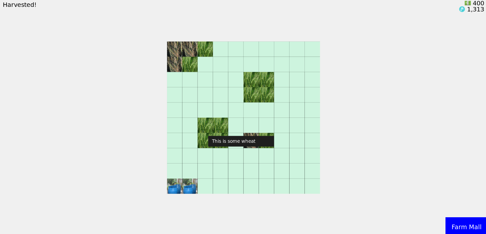

# cartog

Small JS library for building simple management simulators/games, built on top of p5js.

Developed for the Simulation & Cybernetics class at The New School.

More than anything it's meant to let students focus on the system design of their games rather than worry about the nitty-gritty of implementing stuff like menus. In the interest of avoiding causing additional complexity for students, the framework is simple, and so somewhat limited, but hopefully still expressive enough for students to explore a wide variety of interesting domains.

Speaking to the limitations: `cartog` is designed for games that involve a top-down 2D grid and are focused on resource management. The primary interactions it supports are menu-based and grid-clicking. Through a basic event/modal system, `cartog` should be able to handle a decent amount of dialogue narrative.

This is an early first version that will evolve as the needs of the class become clearer.

# Example

See the `example` folder.



# Setup

In your script you need to include the following:

`STATE`, an object that must at least have a `resources` key. For example:

```
const STATE = {
  resources: {
    cash: 1000,
    water: 100
  }
}
```

`RESOURCES`, which map resource names to their in-game representation, e.g:

```
const RESOURCES = {
  cash: '💵',
  water: '🚰'
};
```

These are automatically rendered as part of the UI.

`IMAGES`, which passes in relative file paths of images to use, associating a name with each. These are referenced in the `Item`'s `image` getter (see below). For example:

```
const IMAGES = {
  wheat: 'assets/wheat_0.jpg',
  super_wheat: 'assets/wheat_1.jpg',
  sick_wheat: 'assets/wheat_2.jpg'
};
```

Other values you need to define that configure the 2D grid:

```
const GRID_ROWS = 10;
const GRID_COLS = 10;
const GRID_CELL_SIZE = 40;
const GRID_EMPTY = [205, 244, 222];
```

Then the two top-level functions you should define are:

- `init()`: this is equivalent to p5js' `setup()`. Include one-time setup code here.
- `main()`: this is equivalent to p5js' `draw()`. This is called every frame.

To change the default text color, set `TEXT_DEFAULT_COLOR` to an array of RGB values, e.g.:

```
const TEXT_DEFAULT_COLOR = [255,0,0];
```

To set a background color, set `BACKGROUND_COLOR` to an array of RGB values, e.g.:

```
const BACKGROUND_COLOR = [255,0,0];
```

Or, to use a background image, set `BACKGROUND_IMAGE` to an image url, e.g.:

```
const BACKGROUND_IMAGE = 'https://i.imgur.com/ythxt2c.jpg';
```

Note that this won't do anything to preserve the aspect ratio!

# Classes

The main classes:

## `Item`

Subclass this for objects that can be bought and placed on the grid.

You need to implement the following:

- `get cost()`: this should return an JS object of `{resourceName: resourceCost}`.
- `get info()`: this should return a string describing the item
- `get image()`: this should return the name of the image used to represent this item. It will be forced into a square so keep that in mind.
- `onClick()`: implements a function that's called when the item is clicked on

You can optionally implement:

- `init()`: called when the item is first created. You can, for example, setup some initial values for the item.
- `onPlace()`: called when the item is placed onto the grid. You can, for example, use this to keep track of how many of this item has been purchased.
- `onDestroy()`: called when the item is destroyed/removed from the grid.
- `update(neighbors)`: called every frame and is passed an array of the item's [Moore neighbors](https://en.wikipedia.org/wiki/Moore_neighborhood) in the grid, if any. You can use this, for instance, for cellular automata dynamics and the like (e.g. a blight spreading through a field of crops).

Some built-in methods you'll likely use:

- `destroy()`: removes this item from the grid, effectively destroying it

## `Bonus`

Use this for bonuses that the player can purchase. It's unlikely that you'll need to subclass this.

To create a bonus:

```
let bonus = new Bonus('super fertilizer', 'a good fertilizer that increases crop growth', {'cash': 100}, () => {
  STATE.cropGrowth = 2;
});
```

So you pass in a name for the bonus, a description, then its cost, and an optional effect that's called once the bonus is purchased.

You don't need to provide an effect, you can check elsewhere in your code if the player has the bonus with `hasBonus('super fertilizer')` and do things based on that condition.

If you use the `BuyButton` for buying `Bonus`es, they can only be bought once (the button won't show up afterwards).

The bonuses that a player has will be shown in the bottom-left corner of the screen.

## `Event` and `Action`

If you want in-game events to occur, you'll use these two classes. Wherever you want to create an event, you can do so like so:

```
let ev = new Event('My event name', 'some description of the event');
```

This will create a modal describing the event. By default this just provides an "OK" button for the player to acknowledge the event. If you want players to choose from specific actions, you can do so like so:

```
let ev = new Event('My event name', 'some description of the event', [
  new Action('Fight', {energy: 10}, () => {
    STATE.health -= 20;
  }),
  new Action('Run', {energy: 5}, () => {
    STATE.fatigue += 20;
  })
]);
```

So each `Action` takes an action name, a cost, and a function that describes what happens as a result of choosing that action.

Note that `Event`s pause the game.

# Grid

By default, the grid is a square-based grid. You can use a hex-based grid instead by specifying:

```
const GRID_TYPE = 'hex';
```

By default, the grid is draggable. If you want to disable draggability, you can set:

```
const GRID_DRAG = false;
```

## Grid cells

You may want to have different kinds of cells in the grid, e.g. some cells are water and can't have items placed in them, or certain items can only be placed on certain cells.

You can define custom cells for the grid by subclassing `Cell`. This subclasses can implement:

- `get color()` to return a `[r,g,b]` color for the cell
- `get info()` to return tooltip info for the cell, similar to an `Item`
- `get image()`: this should return the name of the image used to represent this cell, similar to an `Item`
- `canPlace(item)` which determines whether or not a given item can be placed on the cell
- `onClick()` which is called when the cell is clicked with no item on it
- `update(neighbors)`: same as `Item.update(neighbors)`, refer to that description

Then use the cell at a grid position, create an instance of it and use `grid.setCellAt(cell, x, y)`.

For example:

```
class WaterCell extends Cell {
  constructor(depth) {
    super();
    this.depth = depth;
  }

  get color() {
    return [0,0, 255 * 1/Math.sqrt(this.depth)];
  }

  get info() {
    return `this is water at depth ${Math.round(this.depth)}`;
  }

  canPlace(item) {
    return false;
  }
}

// ...

let water = new WaterCell(5);
GAME.grid.setCellAt(water, 0, 0);
```

You can also specify one of these classes as the default cell for the grid:

```
const GRID_DEFAULT_CELL = WaterCell;
```

# Helper functions

The main functions you'll probably use are:

- `showMessage(text, color, timeout, size)`: will show a message on the screen that disappears after `timeout` milliseconds.
- `showModal(title, text, buttons)`: will show a modal/dialog window. The `buttons` parameter is optional; if nothing is specified the modal will just show an "OK" button.
- `hasBonus(bonusName)`: lets you check if the player has a particular bonus or not.
- `pause`: pauses the game and all timers created using `defineHarvester`, `every`, and `schedule`
- `resume`: resumes the game and all timers created using `defineHarvester`, `every`, and `schedule`
- `defineHarvester(name, fn, ms)`: sets a function `fn` to be called every `ms` milliseconds. The function is expected to return a number, which is used to modify the resource named `name`.
- `every(fn, ms)`: call the function `fn` every `ms` milliseconds.
- `schedule(fn, ms)`: call the function `fn` once in `ms` milliseconds.
- `place(item, x, y)`: places an item onto the grid.

# UI

The main UI elements are `Menu`, `Modal`, and `Button`. `Menu` and `Modal` are similar, and more or less function as ways of grouping `Button`s together.

The `Menu` class is well-suited for, well, menus, such as those players can buy items from. You are almost always going to be using buttons for buying `Item`s and `Bonus`es, so there is a `BuyButton` class that handles that specifically:

```
let menu = new Menu('Farm Mall', [
  new BuyButton('Buy Water Collector', WaterCollector),
  new BuyButton('Buy Wheat', Wheat)
]);
```

So buttons basically take a title and then a function that's executed if that button is clicked.

One thing of note with the `Menu` class it that when you create a new `Menu`, it will automatically have a button added to the page that will open that menu when clicked.

The `Modal` class is very similar to the `Menu` class, but as the name suggests more appropriate for modals/popups.

Note that all `Modal`s and `Menu`s pause the game.

# Meters

You can create percentage meters with the `Meter` class:

```
let meter = new Meter('Meter Name', 10);
```

Where the second parameter is the initial value, which should be between 0 and 100.

To update the value of the meter:

```
meter.update(50);
```